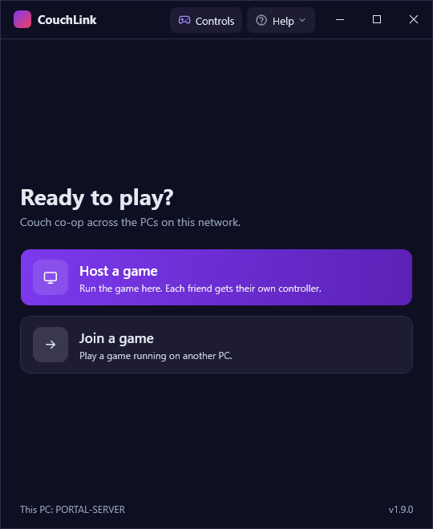
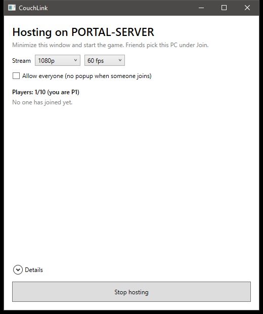
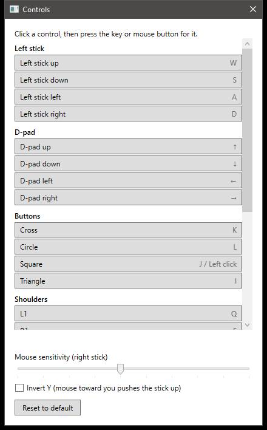

# CouchLink

[](https://github.com/enriquezchristopher/CouchLink/actions/workflows/ci.yml)
[](https://github.com/enriquezchristopher/CouchLink/releases/latest)
[](LICENSE)


Play couch co-op games across the PCs on your LAN. One PC runs the game and
hosts; the other PCs join, see and hear the host's screen, and **each joining
PC gets its own virtual controller** on the host, driven by its keyboard and
mouse. The game sees separate controllers, so every PC is a separate player.

Built for internet cafés and LAN rooms: everything runs on your local
network, with **no accounts, no cloud and no internet** required.

<p align="center">
  
  
  
</p>

## Features

- **Up to 10 players** on one game: the host player on the keyboard, plus up
  to 9 joining PCs, each as its own virtual DualShock 4.
- **Low-latency streaming**: GPU screen capture, hardware H.264 encoding
  (AMD AMF, NVIDIA NVENC, with a CPU fallback), error correction over UDP and
  GPU decoding. Typically 20 to 35 ms from the host's screen to a joining
  PC's screen on a wired LAN.
- **Game sound** on every joining PC, with Opus audio and a small jitter
  buffer.
- **Find and join in two clicks**: hosts appear in a list on the network;
  the host approves each player with a popup, or lets everyone in.
- **Built for shared PCs**: while playing, the Windows key and Alt+Tab are
  blocked and the mouse stays in the game; F1 shows the keys; Ctrl+Alt+Q
  leaves. Keys can be changed mid-game and reset when CouchLink closes.
- **Controller profiles**: save a key layout for a game as a file, put it
  in the `profiles` folder on every PC, and players pick it from a list.
  Profiles can name each button ("Shoot", "Pass") on the F1 panel. An
  **NBA 2K22** profile with the game's own PC keyboard keys comes with
  CouchLink.
- **Recovers by itself**: brief network drops reconnect automatically, and a
  dropped player gets the same controller back.
- **No install needed** on joining PCs: unzip and run. No .NET to install.

## How it works

```
 Joining PC (P2..P10)                          Host PC (P1)
┌──────────────────────┐   keyboard + mouse   ┌──────────────────────────┐
│ CouchLink            │ ───────────────────▶ │ CouchLink                │
│  shows the stream    │   (UDP 47803)        │  virtual DualShock 4 ──▶ │ the game
│  plays the sound     │ ◀─────────────────── │  captures screen + sound │
└──────────────────────┘   video + audio      └──────────────────────────┘
                           (UDP 47802)
```

The host's game sees one extra controller per joining PC, created with the
[ViGEmBus](https://github.com/nefarius/ViGEmBus) driver. See the
[design spec](docs/superpowers/specs/2026-10-05-couchlink-design.md) for the
details.

## Requirements

| | Host PC | Joining PCs |
|---|---|---|
| OS | Windows 10/11, 64-bit | Windows 10/11, 64-bit |
| GPU | AMD or NVIDIA with a hardware video encoder | Any that decodes H.264 |
| Driver | [ViGEmBus](https://github.com/nefarius/ViGEmBus/releases) | None |
| Network | Wired LAN, same subnet | Wired LAN, same subnet |

## Quick start

1. Download `CouchLink-vX.Y.Z-win-x64.zip` from
   [Releases](https://github.com/enriquezchristopher/CouchLink/releases/latest)
   and unzip it on every PC.
2. On the host, install the
   [ViGEmBus driver](https://github.com/nefarius/ViGEmBus/releases).
3. Start `CouchLink.App.exe` on every PC. When Windows Firewall asks, allow
   it on **both** private and public networks.
4. On the host, click **Host**, then start the game in borderless windowed
   mode.
5. On each other PC, click **Join** and pick the host. The host clicks
   **Allow**, and the player is in.

The **[setup guide](docs/cafe-setup-guide.md)** covers everything in more
depth: firewall rules for many PCs at once, game settings, the controls
editor, stream quality, reading the stats, and troubleshooting.

## Default controls

| Controller | Keys | Controller | Keys |
|---|---|---|---|
| Left stick | W A S D | L1 / R1 | Q / E |
| Right stick | Mouse | L2 / R2 | Ctrl / Shift |
| D-pad | Arrow keys | L3 / R3 | F / middle mouse |
| Cross / Circle | K / L | Options / Share | Enter / Backspace |
| Square / Triangle | J or left mouse / I | Touchpad | Tab |

While playing: **F1** shows the keys, **F2** shows connection stats,
**Ctrl+Alt+C** changes keys, **Ctrl+Alt+Q** leaves. See
[Controls](docs/cafe-setup-guide.md#7-controls) in the guide.

## Game compatibility

| Game | Status |
|---|---|
| NBA 2K22 | Works: each joining PC appears as its own controller. |
| NBA 2K14 | Not yet: only one virtual controller is detected and its left stick doesn't move the player ([#30](https://github.com/enriquezchristopher/CouchLink/issues/30), [#49](https://github.com/enriquezchristopher/CouchLink/issues/49)). |

Tried another game? Please
[open an issue](https://github.com/enriquezchristopher/CouchLink/issues/new/choose)
with what worked.

## FAQ

**Does it work over the internet?** No. CouchLink is made for one local
network and doesn't route over the internet by design.

**Does it work over Wi-Fi?** It runs, but expect stutter. Use cables.

**Do joining PCs need the game?** No, only the host.

**Can players use real gamepads?** No. Joining PCs use keyboard and mouse,
which every café PC has.

**Is my key layout saved?** No, on purpose: in a café the next customer
should start with the default layout. Changes last until CouchLink closes.

**Which GPUs work for hosting?** AMD and NVIDIA GPUs with a hardware encoder.
Without one (for example a GT 710 or GT 1030), the host encodes on the CPU,
which lags with heavy games.

## Status and roadmap

CouchLink is in active development. Streaming, sound, the lobby, the playing
screen and the controls editor are done; an installer that sets up the
driver and the firewall in one step is next. See the [roadmap](ROADMAP.md)
and the [changelog](CHANGELOG.md).

## Reporting a problem

- **A crash:** CouchLink saves a report and shows where it is (or click
  **Crash reports** on the Start screen). Reports contain no PC names, user
  names or IP addresses. Attach the file to a
  [new issue](https://github.com/enriquezchristopher/CouchLink/issues/new/choose).
- **Something else:** describe what you did and what happened, and attach
  the newest log from `%LOCALAPPDATA%\CouchLink\Logs`. For lag, include a
  screenshot of F2 on the joining PC and the host lobby's **Details**.
- **A security issue:** see [SECURITY.md](SECURITY.md); please don't open a
  public issue.

## Building from source

Requires the [.NET 10 SDK](https://dotnet.microsoft.com/download).

```powershell
./eng/get-ffmpeg.ps1       # once: FFmpeg 9 for host video, into third_party/ffmpeg
dotnet build               # warnings are errors
dotnet test
./eng/package.ps1          # builds artifacts/CouchLink-v<version>-win-x64.zip
```

`PadTest\CouchLink.PadTest.exe check 9` checks, without any game, that a PC
can create 9 separate virtual controllers and that every button, stick and
trigger works on each. `VideoTest\CouchLink.VideoTest.exe encode 5` checks
that the host's GPU can capture and encode at 60 fps.

## Contributing

Contributions are welcome. See [CONTRIBUTING.md](CONTRIBUTING.md) for how we
work (design first, test first, Conventional Commits, signed commits) and
follow the [Code of Conduct](CODE_OF_CONDUCT.md).

## License

CouchLink is licensed under the [GNU General Public License v3.0](LICENSE).
It builds on [ViGEmBus](https://github.com/nefarius/ViGEmBus) and
[ViGEm.NET](https://github.com/nefarius/ViGEm.NET),
[FFmpeg](https://ffmpeg.org), [NAudio](https://github.com/naudio/NAudio),
[Concentus](https://github.com/lostromb/concentus) and
[Vortice.Windows](https://github.com/amerkoleci/Vortice.Windows); see
[THIRD-PARTY-NOTICES.md](THIRD-PARTY-NOTICES.md) for every component and its
license.
