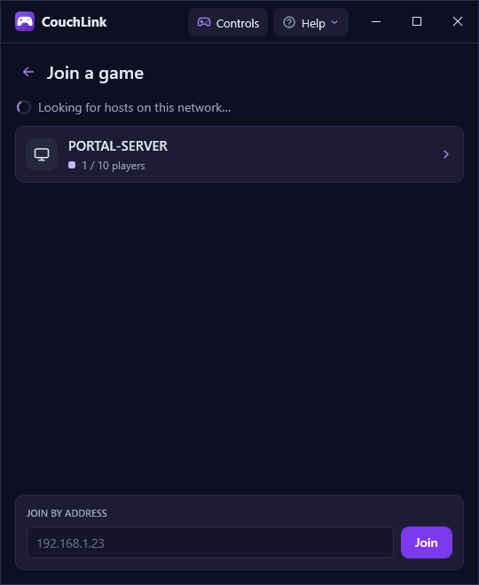

# CouchLink setup guide

This guide is for whoever sets up CouchLink in a café, LAN room or at home:
installing it, the first session, the controls, and what to do when something
doesn't work. It quotes the app's buttons and messages exactly as they appear
on screen.

- [1. How it works](#1-how-it-works)
- [2. Before you start](#2-before-you-start)
- [3. Install](#3-install)
- [4. Game settings](#4-game-settings)
- [5. The first session](#5-the-first-session)
- [6. While playing](#6-while-playing)
- [7. Controls](#7-controls)
- [8. Stream quality and performance](#8-stream-quality-and-performance)
- [9. Troubleshooting](#9-troubleshooting)
- [10. Updating and removing](#10-updating-and-removing)
- [11. Advanced: command-line options](#11-advanced-command-line-options)

## 1. How it works

One PC runs the game and **hosts**. Every other PC **joins**: it shows the
host's screen and plays its sound, and its keyboard and mouse become a
controller in the game. The host creates one virtual DualShock 4 controller
per joining PC, so the game sees separate players.

- Up to 10 players: the host player on the game's own keyboard controls (P1),
  plus up to 9 joining PCs (P2 to P10).
- Everything stays on your local network. No accounts, no internet.
- Joining PCs don't need the game installed.

## 2. Before you start

| | Host PC | Joining PCs |
|---|---|---|
| Windows | 10 or 11, 64-bit | 10 or 11, 64-bit |
| Network | Wired, same switch or subnet as the others | Wired, same switch or subnet |
| Graphics | AMD or NVIDIA GPU with a hardware video encoder (most cards from the last ten years) | Any GPU that decodes H.264 video (almost all) |
| Extra software | The game, and the [ViGEmBus driver](https://github.com/nefarius/ViGEmBus/releases) | None |

A gigabit wired network is recommended. Wi-Fi works badly for game streaming:
expect stutter and lag.

CouchLink doesn't need .NET or anything else installed; the download includes
everything.

## 3. Install

### On every PC

1. Download `CouchLink-vX.Y.Z-win-x64.zip` from
   [Releases](https://github.com/enriquezchristopher/CouchLink/releases)
   (under **Assets** of the latest release).
2. Unzip it to a folder that stays put, for example `C:\CouchLink`.
3. Start `CouchLink.App.exe`. Pin it to the taskbar or make a desktop
   shortcut if you like.

Windows may warn "Windows protected your PC" because CouchLink isn't
code-signed. Click **More info**, then **Run anyway**.

### On PCs that will host: the ViGEmBus driver

The host needs the free ViGEmBus driver to create the virtual controllers.

1. Download `ViGEmBus_1.22.0_x64_x86_arm64.exe` from the
   [ViGEmBus releases page](https://github.com/nefarius/ViGEmBus/releases).
2. Run it and accept the defaults.

If the driver is missing, hosting fails with "ViGEmBus driver not installed".
It's safe to install it on every PC, so any PC can host.

### Windows Firewall

The PCs talk to each other on these ports:

| Port | What it carries |
|---|---|
| UDP 47800 | Finding hosts on the network |
| TCP 47801 | Joining, approval, keeping the session alive |
| UDP 47802 | Video and audio, host to joining PC |
| UDP 47803 | Controller input, joining PC to host |

The first time you click **Host** or **Join**, Windows Firewall may ask
whether to allow CouchLink. Tick **both** "Private networks" and "Public
networks", then click **Allow access**. Windows often treats a café network
as public, and with only "Private" ticked, the PCs won't find each other.

To set the rules up in advance on many PCs instead, run this in PowerShell as
administrator on each PC. Change the path if CouchLink is somewhere other
than `C:\CouchLink`:

```powershell
$app = 'C:\CouchLink\CouchLink.App.exe'
$rules = @(
    @{ Name = 'CouchLink (UDP 47800, discovery)';       Protocol = 'UDP'; Port = 47800 },
    @{ Name = 'CouchLink (TCP 47801, sessions)';        Protocol = 'TCP'; Port = 47801 },
    @{ Name = 'CouchLink (UDP 47802, video and audio)'; Protocol = 'UDP'; Port = 47802 },
    @{ Name = 'CouchLink (UDP 47803, input)';           Protocol = 'UDP'; Port = 47803 }
)
foreach ($r in $rules) {
    Remove-NetFirewallRule -DisplayName $r.Name -ErrorAction SilentlyContinue
    New-NetFirewallRule -DisplayName $r.Name -Direction Inbound -Action Allow `
        -Protocol $r.Protocol -LocalPort $r.Port -Program $app `
        -Profile Any -RemoteAddress LocalSubnet | Out-Null
}
```

The rules only allow traffic from your local network (`LocalSubnet`), so the
ports stay closed to the internet.

### Check the controllers (optional)

On a host, `PadTest\CouchLink.PadTest.exe check 9` creates 9 virtual
controllers and checks every button, stick and trigger on each, without any
game. It ends with a pass or fail line for each controller.

## 4. Game settings

- **Run the game in borderless windowed mode** (some games call it "windowed
  fullscreen"). CouchLink captures the host's screen, and exclusive
  fullscreen can hide the picture from it.
- **Use a resolution and frame rate the host's GPU handles comfortably.** The
  same GPU runs the game and encodes the video.
- **NBA 2K22:** each joining player appears as a controller on the controller
  select screen; move it to a team as usual. The host player uses the
  keyboard.
- **NBA 2K14:** joining players' controllers are detected, but the left stick
  doesn't move the player, and only one virtual controller is accepted. See
  [#49](https://github.com/enriquezchristopher/CouchLink/issues/49) and
  [#30](https://github.com/enriquezchristopher/CouchLink/issues/30).

## 5. The first session


### On the host

1. Start CouchLink and click **Host**.
2. The host lobby opens. Pick the **Stream** quality (see
   [section 8](#8-stream-quality-and-performance)), then minimize the window
   and start the game.


### On each joining PC

1. Start CouchLink and click **Join**.
2. Hosts on your network appear in the list as "PC name · players/10
   players". Click the host.



If the host doesn't appear, click **Join by address...** and type the host's
IP address (run `ipconfig` on the host to find it).

### Approving players

When someone joins, a small popup appears in the bottom-right corner of the
host's screen with **Allow** and **Deny**. If nobody answers within 30
seconds, the request is denied and the joining PC shows "The host didn't
answer."

Tick **Allow everyone (no popup when someone joins)** in the host lobby to let
anyone on the network join without the popup.

Once allowed, the joining PC goes fullscreen with the game, and its keyboard
and mouse control its player (P2, P3 and so on, in joining order).

### Managing players on the host

- The lobby lists each player; **Kick** removes one ("You were removed by the
  host." on their screen).
- **Stop hosting** ends the session for everyone ("Host ended the session.").
- **Details** shows the stream: the video encoder in use, the resolution,
  how many clients get video, and audio.

## 6. While playing

On a joining PC:

| Key | What it does |
|---|---|
| F1 | Shows or hides the controls: every button and its key |
| F2 | Shows or hides connection stats (see [section 8](#8-stream-quality-and-performance)) |
| Ctrl+Alt+C | Opens the controls editor over the game |
| Ctrl+Alt+Q | Leaves the session (Alt+F4 works too) |

While the game is in front:

- The Windows key, Alt+Tab, Alt+Esc and Ctrl+Esc do nothing, so a stray key
  doesn't drop a player to the desktop. Use Ctrl+Alt+Q to leave.
- The mouse pointer stays inside the game window, even with two monitors.
- A hint "F1: controls · Ctrl+Alt+Q: leave" shows for the first 5 seconds.

If the network drops for a moment, the screen shows "Reconnecting..." and
play resumes by itself within about 10 seconds. After that the joining PC
shows "Lost the host."; pick the host again within a minute to get the same
player back without a new approval.

## 7. Controls

Each joining PC's keyboard and mouse act as a DualShock 4 controller.

### Default layout

| Controller | Keys |
|---|---|
| Left stick | W A S D |
| Right stick | Mouse |
| D-pad | Arrow keys |
| Cross (×) | K |
| Circle (○) | L |
| Square (□) | J or left mouse button |
| Triangle (△) | I |
| L1 / R1 | Q / E |
| L2 / R2 | Ctrl / Shift |
| L3 / R3 | F / middle mouse button |
| Options | Enter |
| Share | Backspace |
| Touchpad | Tab |

The mouse acts like a stick that springs back to the centre: move it to push
the right stick, and the stick returns to the middle when the mouse stops.

### Changing keys


Open the editor with **⚙ Controls** on the Start screen or the session
screen, or with **Ctrl+Alt+C** during a game.

- Click a control, then press the key or mouse button for it. Mouse side
  buttons work too. Esc cancels.
- Each key does one thing. Choosing a key that another control uses moves it,
  and the editor says where it came from (for example "Space moved from
  Cross."); that control is then left without a key until you give it one.
- Esc, F1, F2 and the Windows keys are reserved and can't be bound.
- **Mouse sensitivity (right stick)** goes from 1 (slow) to 10 (fast).
- **Invert Y** flips the mouse's up and down on the right stick.
- **Reset to default** restores the layout above.

Changes apply at once, even in the middle of a game. They last until
CouchLink closes, so each new customer starts with the default layout.

### Profiles

A profile is a key layout for one game, saved as a file. Players pick one
from the **Profile** list at the top of the controls editor instead of
changing keys one by one.

- **Set them up once:** make a `profiles` folder next to
  `CouchLink.App.exe` and put the profile files in it. Copy the folder to
  every PC. The list reads the folder each time the editor opens.
- **Make one:** change the keys in the editor, then click **Save as…**,
  give it a name (this is what players see in the list) and save it in the
  `profiles` folder.
- **Name the buttons:** tick **Show labels** and type what each button
  does in the game, such as "Shoot" or "Pass". The labels are saved with
  the profile, and F1 shows them during a game.
- **Load one from elsewhere:** **Browse…** opens a profile from a USB stick
  or any folder.
- A profile that doesn't load is left out of the list. The editor (for
  **Browse…**) or the log (for the `profiles` folder) says why, for example
  `"Square": unknown key "Spcae"`.

Changes made after loading a profile show "(changed)" and don't change the
file. **Reset to default** goes back to the layout above. As with any key
change, everything resets when CouchLink closes.

Profiles are JSON files that can also be edited in Notepad. The design
document lists every field and key name:
[controller profiles design](superpowers/specs/2026-10-08-couchlink-controller-profiles-design.md#2-file-format).

## 8. Stream quality and performance

The host lobby's **Stream** setting picks the resolution (Native, 1080p,
900p, 720p, 540p) and the frame rate (60 fps, or higher up to the host
monitor's refresh rate). Higher settings look sharper and need more from the
host's GPU and the network.

- Start with **1080p** at **60 fps**. On older or smaller GPUs, or if
  joining players see stutter, try **900p** or **720p**.
- The host lobby's **Details** shows the video encoder. `h264_amf` (AMD) or
  `h264_nvenc` (NVIDIA) with "(hardware)" is what you want. `libx264` with
  "(software)" and "No hardware encoder - may lag with heavy games." means
  the host encodes on the CPU, which struggles alongside a game.
- From version 1.6.2, **Details** also shows "GPU priority: realtime" (or
  "high"). CouchLink asks Windows to run its capture and encoding ahead of
  the game on the GPU, so a busy game doesn't starve the stream.

### Reading F2 on a joining PC

```
60 fps  8.2 Mbps  (D3D11VA)
Packet loss 0.0%  FEC repairs 0/s
Latency ~22 ms (host 9 + network 1 + client 3)
```

- **fps**: pictures shown per second. It should stay near the stream's frame
  rate.
- **(D3D11VA)**: the joining PC decodes on its GPU. Anything else means it
  decodes on the CPU.
- **Packet loss / FEC repairs**: lost network packets, and how many the
  stream rebuilt. More than about 1% loss points to the network: check the
  cable and switch, and don't use Wi-Fi.
- **Latency**: the delay from the host's screen to this screen, split into
  the host's capture and encoding, the network, and this PC's decoding and
  display. A large **host** number points to the host PC (see above); a large
  **network** number points to the network.

## 9. Troubleshooting

| Problem | What to check |
|---|---|
| The host doesn't appear in the Join list | Both PCs on the same switch or subnet? Firewall allowed on **Public** networks too ([section 3](#windows-firewall))? Use **Join by address...** with the host's IP. |
| "ViGEmBus driver not installed" when hosting | Install the [ViGEmBus driver](https://github.com/nefarius/ViGEmBus/releases) on the host. |
| A joining player has no controller in the game | On the host, check Device Manager > System devices for "Nefarius Virtual Gamepad Emulation Bus". Restart the game after installing the driver, and check the game's controller settings. |
| "The host didn't answer." or "Request denied." | Someone on the host has to click **Allow** within 30 seconds, or tick **Allow everyone**. |
| Black screen on the joining PC | Run the game in borderless windowed mode on the host. F2 on the joining PC shows whether video arrives. |
| Stutter or low fps | F2 on the joining PC: high **host** latency means the host GPU is overloaded (lower the Stream resolution); packet loss means the network. Check the host's Details for "(software)". |
| No sound on the joining PC | Check the joining PC's speakers or headphones. If both PCs are the same machine (testing), the client mutes itself on purpose. |
| Keys don't work in the game | Click inside the game window once so it has the keyboard. F1 shows the current layout. |
| CouchLink crashed | See below. |

### Crash reports

If CouchLink crashes, it saves a report and shows where. Click **Crash
reports** on the Start screen to open the folder
(`%LOCALAPPDATA%\CouchLink\CrashReports`). Reports contain no PC names, user
names or IP addresses. Please attach the file to a
[new issue](https://github.com/enriquezchristopher/CouchLink/issues/new/choose).

Logs are in `%LOCALAPPDATA%\CouchLink\Logs`; the newest file helps with
problems that aren't crashes.

## 10. Updating and removing

**Updating:** close CouchLink on the PC, delete the old folder's contents, and
unzip the new version into the same folder. Keep the same folder so the
firewall rules still match. All PCs should run the same version.

**Removing:** delete the CouchLink folder. To remove the firewall rules, run
in PowerShell as administrator:

```powershell
Remove-NetFirewallRule -DisplayName 'CouchLink (*'
```

ViGEmBus can stay (other programs use it too) or be removed from Settings >
Apps.

## 11. Advanced: command-line options

Start `CouchLink.App.exe` with these from a Command Prompt or a shortcut:

| Option | What it does |
|---|---|
| `--windowed-player` | Shows the game in a normal window instead of fullscreen, without blocking keys or locking the mouse. Also lets a second CouchLink run on the same PC, to test hosting and joining on one machine. |
| `--test-pattern` | The host streams a moving test picture instead of the screen. |
| `--test-tone` | The host plays a test tone instead of the PC's sound. |
| `--audio-loss=5` | A joining PC drops 5% of audio packets, to test sound repair. |
| `--save-video=file.h264` | A joining PC also saves the received video to a file. |
